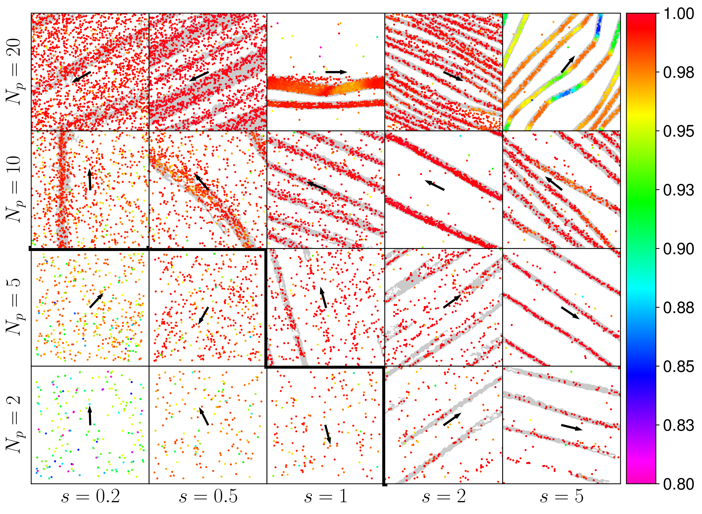
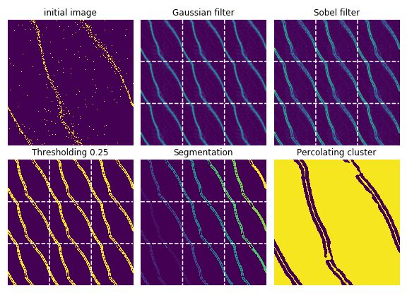

+++
title = "Trail Formation in Signalling Agents"
description = "From local message-passing to system-wide patterns: simulations and PDEs of self-organising active matter."
date = 2026-05-04
weight = 4

[extra]
thumbnail = "demo-web.mp4"
tags = ["C++", "Python", "scikit-image", "Agent-Based Modeling", "PDEs", "Active Matter", "Statistical Physics"]
+++

## Problem

How do coherent, large-scale patterns emerge from individuals who only exchange small, fleeting signals?

The question shows up across domains. In **opinion dynamics**, people rarely change views from a single conversation; opinions form gradually from a stream of small messages (like chats, tweets, headlines). In **biology**, ants coordinate foraging by laying and following pheromone trails: *Auto-chemotaxis*. The shared structure: agents couple to each other indirectly, through a co-evolving secondary field (messages, pheromones) that they themselves produce and that decays over time.

The key ingredient is **delayed feedback**: an agent's signal can keep influencing others long after the agent has moved on.

## Approach

I built off-lattice agent-based simulations of self-propelled particles that deposit oriented pheromone traces and steer toward neighbouring deposits. The model spans a 2D state space of agent density and signal-coupling strength, and was simulated at scales relevant to insect colonies.

Implementation in C++ for performance, with analysis pipelines in Python. Quantifying the emergent patterns (densities, trail widths, alignment) required image-processing pipelines built with **scikit-image** to extract structure from simulation snapshots.

## Key Findings

The system organises into distinct stationary patterns depending on how long signals persist:

- **Short-lived signals** → transverse bands of moving agents (Vicsek-like behaviour).
- **Long-lived signals** → narrow longitudinal trails aligned with motion direction.

## Continuum Extension

To understand *why* these phases appear, we derived a hydrodynamic limit (a system of PDEs for agent density and pheromone concentration) using a mean-field approximation. Linear stability analysis of the homogeneous state recovers the phase boundaries seen in simulation, confirming that time-delayed feedback is what stabilises the trails.

## Publication

Mokhtari, Patterson & Höfling, *Spontaneous trail formation in populations of auto-chemotactic walkers*, [New Journal of Physics 24, 013012](https://iopscience.iop.org/article/10.1088/1367-2630/ac43ec) (2022).

Project context: MATH+ Emerging Field [EF4-10: Multi-Agent Social Systems](https://mathplus.de/research-2/emerging-fields/emerging-field-45-multi-agent-social-systems/ef4-10/) (FU Berlin).
