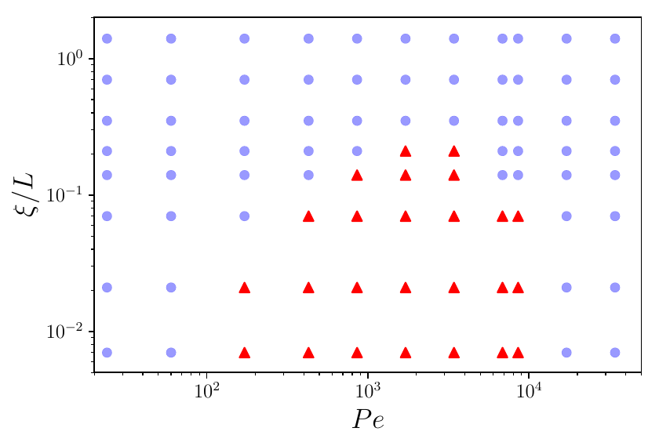

+++
title = "Active Filaments in Porous Media"
description = "How flexibility and activity govern the motion of elongated self-propelled agents in cluttered environments."
date = 2026-05-04
weight = 2

[extra]
thumbnail = "thumb.jpg"
tags = ["C++", "Python", "Statistical Physics", "Molecular Dynamics", "Active Matter"]
+++

## Problem

How do elongated self-propelled agents (think bacteria, or any active filament) move through an environment full of obstacles? Real biological habitats are rarely empty: cells navigate tissues, microbes move through soil and porous gels. The interplay between an agent's *flexibility*, its *activity*, and the *geometry of its surroundings* shapes whether it travels freely, gets stuck, or moves in unexpected ways.

## Approach

I built large-scale molecular dynamics simulations of active polymers (semi-flexible chains driven by a constant tangential force) in a randomly placed obstacle field. Implemented in C++ for performance, with analysis pipelines in Python.

Stiffness, activity (Péclet number), and chain length were varied systematically. The motion was characterized using statistical descriptors borrowed from anomalous transport — waiting-time distributions, mean-squared displacement scaling, and a continuous-time random walk model with renewal events.

## Key Finding

A sharp transition emerges as chains become more flexible: stiff chains glide through the medium almost unhindered, while flexible ones spiral around obstacles and get trapped. The waiting-time distribution develops heavy tails, taking transport from diffusive to subdiffusive and eventually fully caged.

<video controls width="100%">
  <source src="demo-web.mp4" type="video/mp4">
</video>

## Publication

Mokhtari & Zippelius, *Dynamics of active filaments in porous media*, [Phys. Rev. Lett. 123 (2), 028001](https://journals.aps.org/prl/abstract/10.1103/PhysRevLett.123.028001) (2019).
